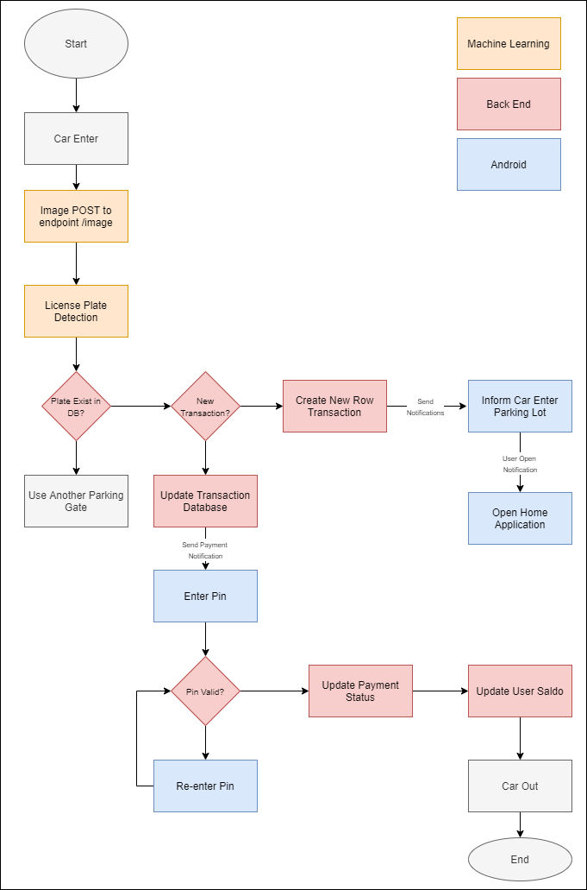
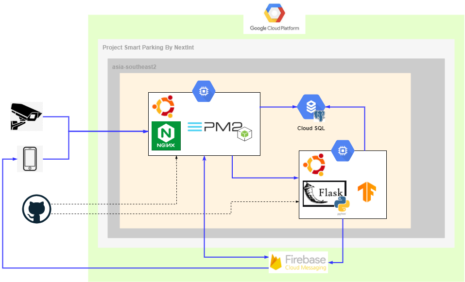

<p align="center">
  <h1 align="center">Next Parking</h1>
  <h3 align="center">Pay, save and track your parking. </h3>

</p>

# Table of Contents
1. [Meet the Team](#Meet-the-Team)
2. [About Next Parking](#About-Next-Parking)   
3. [Highlight Features](#Highlight-Features)
4. [Products](#Products)
    1. Android Application
    2. Machine Learning
    3. REST API

# Meet the Team


|         Member              | Student ID |        Path        |                Role                        |                                                  Contacts                                                  |
| :--------------------:      | :--------: | :----------------: | :----------------------------------------: | :--------------------------------------------------------------------------------------------------------: |
|   Nevindra Ibnazhifi        |  M0090939  |  Machine Learning  | Project Manager, Machine Learning Developer|  [LinkedIn - Nevindra] or [Github - Nevindra]        |
|   Sekar Larasati Muslimah   |  M0090939  |  Machine Learning  |         Machine Learning Developer         |     [LinkedIn - Sekar] or [Github - Sekar]     |
|  Anna Karenina Jusuf        |  A2112055  | Mobile Development |              Android Mobile Developer      | [LinkedIn - Anna] or [Github - Anna] |
|  Sahir Syatha               |  A0090941  | Mobile Development |              Android Mobile Developer      | [LinkedIn - Sahir] or [Github - Sahir] |
|     Akhdan Muhardi          |  C0040284  |  Cloud Computing   |            Business Development            | [LinkedIn - Akhdan] |
|          Ledy               |  C1881900  |  Cloud Computing   |                   DevOps                   |     [LinkedIn - Ledy] or [Github - Ledy]     |

# About Next Parking

NextInt’s Smart Parking emphasizes cashless, paperless, and touchless transactions within the parking service system. It utilizes machine learning to detect the license plate number of the vehicle.

# Highlight Features

Here are our for our highlighted features:

```
1. Car Plate Detection
2. Car Plate Number Reader
3. Real Time Notifaction Transaction
4. Top Up Simulation
5. Payment Security
```

# Products

Link to each of our repository:
1. [Mobile Development Repository](https://github.com/sahirrrr/NextParking)
2. [Machine Learning Repository](https://github.com/sekarlm/license-plate-recognition)
3. [Smart Parking REST API](https://github.com/nevindra/bangkit-api)
4. [Cloud Architecture](https://github.com/vrider46/nexintcloud/tree/main)

## Android
![kotlin-badge] ![firebase-badge]


### Main Feature

<ul>
  <li>Login</li>
  <li>Register</li>
  <li>Current parking location</li>
  <li>History parking</li>
  <li>Parking payment</li>
  <li>Top up balance</li>
  <li>History top up</li>
  <li>Multi vehicle</li>
  <li>Add vehicle</li>
  <li>Safety pin</li>
  <li>Image picker</li>
  <li>Push notification</li>
  <li>Logout</li>
</ul>

### Tech Stack

<ul>
  <li>100% Kotlin</li>
  <li>AndroidX</li>
  <li>38 Jetpack Library</li>
  <li>RX Java</li>
  <li>Koin as Dependency Injection</li>
  <li>Firebase Cloud Messaging</li>
  <li>Glide</li>
  <li>Retrofit</li>
</ul>

### Architechture


MVVM with Clean Architechture for Easy to navigate, Maintainable and Testable code.

## Machine Learning

![tensorflow-badge] ![flask-badge]

We have these processes that will running in the cloud. In this development we use simulation that will run like this:



## Cloud Computing
![nginx-badge]



Why we use Cloud ?
- Low entry cost
- Ability to scale on-demand
- Go-to-market quicker
- Focus on core business

What we use ?
- Cloud Service : Google Cloud Platform
- Compute : E2 VM - Ubuntu20.04
- VPC: asia-southeast2/a
- DB : Cloud SQL - PostgreSQL
- Notification : Firebase
- Repo : Github
- Proxy : Nginx
- Web Server : PM2, Flask

## REST API
![node-badge] ![sql-badge] 

We are using **NodeJS** with **Express** Framework and **PostgreSQL** as our development technology stack. This REST API
is used to support our Android Application.


[tensorflow-badge]: https://img.shields.io/badge/Tensorflow-Object%20Detection-FF6F00?style=flat&logo=Tensorflow
[flask-badge]: https://img.shields.io/badge/REST%20API-NextInt%20API-FF6F00?style=flat&logo=flask
[kotlin-badge]: https://img.shields.io/badge/Android-NextInt%20Application-FF6F00?style=flat&logo=kotlin
[firebase-badge]: https://img.shields.io/badge/Android-Notification%20Sender-FF6F00?style=flat&logo=firebase
[node-badge]: https://img.shields.io/badge/REST%20API-NextInt%20API-FF6F00?style=flat&logo=express
[sql-badge]: https://img.shields.io/badge/REST%20API-NextInt%20API-FF6F00?style=flat&logo=postgresql

[nginx-badge]: https://img.shields.io/badge/Cloud%20Computing-Nginx-FF6F00?style=flat&logo=nginx
[gcp-badge]: https://img.shields.io/badge/Cloud%20Computing-Nginx-FF6F00?style=flat&logo=nginx


<!-- Linked In -->
[Linkedin - Akhdan]: https://www.linkedin.com/in/akhdanmuhardi/
[LinkedIn - Nevindra]: https://www.linkedin.com/in/nevindraa/
[Linkedin - Sahir]: https://www.linkedin.com/in/sahir-syatha/
[Linkedin - Anna]: https://www.linkedin.com/in/annkarenina/
[Linkedin - Ledy]: https://www.linkedin.com/in/cloudsecledy/
[Linkedin - Sekar]: https://www.linkedin.com/in/sekar-larasati/

<!-- Linked In -->
[Github - Nevindra]: https://github.com/nevindra
[Github - Sahir]: https://github.com/sahirrrr
[Github - Anna]: https://github.com/itsannazzle
[Github - Ledy]: https://github.com/vrider46
[Github - Sekar]: https://github.com/sekarlm